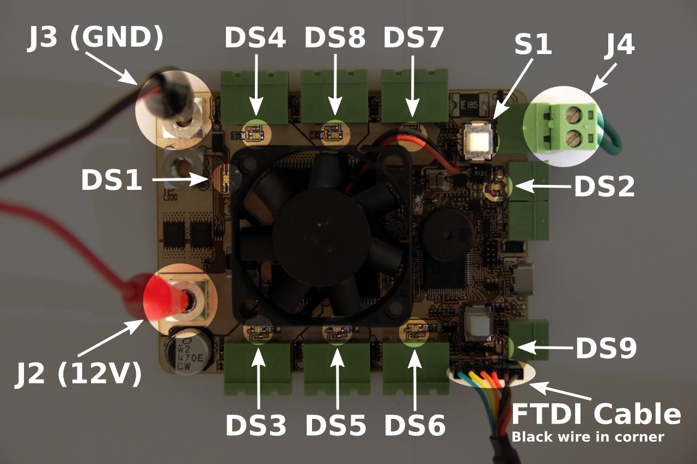

Student Robotics PBv4b Manufacture Test Procedure[^1]
===============================================

Test Jig Parts
==============

 * Netbook (white)
 * Netbook power supply
 * FTDI cable (black)
 * Power cable (red/black with crocodile clips and fork terminals)
 * Shorted 2-way connector (green)

Test Jig Setup
==============

1. Connect red/black power cable to bench power supply
1. Set bench power supply to 12V with 200mA current limit
1. Plug netbook power supply into netbook/mains socket
1. Plug FTDI cable into netbook
1. Turn netbook on. Type 'pbv4b' and press enter

Board Test Procedure
====================

Figure 1 shows a board with the power and FTDI cables connected and the location of the various LEDs.

1. Clip the red/black power cable to the terminals as shown in Figure 1
2. Plug FTDI cable into the 6-pin header as shown in Figure 1
3. **Plug shorted 2-way connector into J4 as shown in Figure 1**
4. Turn on bench power supply
5. Press power button S1 (next to J4)
6. The board must not draw more than 15mA and green LED DS1 must illuminate
7. Press enter on the netbook
8. The netbook must report that it has succesfully flashed the board
9. The board should perform the following actions in sequence. It will repeat the sequence forever. If a particular action does not happen, or it stops, then the potential problem components are listed
   
   | Indication       | Potential causes of failure     |
   |------------------|---------------------------------|
   | DS3 flash green  | DS3, R21, J8, U5, RN3, U10, Y1  |
   | DS5 flash green  | DS5, R35, J10, U7, RN3, U10, Y1 |
   | DS6 flash green  | DS6, R38, J11, U7, RN3, U10, Y1 |
   | DS7 flash green  | DS7, R41, J12, U8, RN1, U10, Y1 |
   | DS8 flash green  | DS8, R46, J13, U8, RN1, U10, Y1 |
   | DS4 flash green  | DS4, R28, J9, U6, R32, U10, Y1  |
   | DS3 flash red    | DS3, R65, U10, Y1               |
   | DS5 flash red    | DS5, R67, U10, Y1               |
   | DS6 flash red    | DS6, R68, U10, Y1               |
   | DS7 flash red    | DS7, R69, U10, Y1               |
   | DS8 flash red    | DS8, R70, U10, Y1               |
   | DS4 flash red    | DS4, R66, U10, Y1               |
   | Fan on for ~1s   | X2, Q3, F3, R6, U10, Y1         |
   | DS2 flash green  | DS2, R19, U3, F4, R75, U10, Y1  |
   | Piezo beep       | X1, Q5, R51, R55, U10, Y1       |
   | DS9 flash green  | DS9, R72, U1, R60, R61, U10, Y1 |
   | DS9 flash red    | DS9, R73, U4, R60, R61, U10, Y1 |

10. Turn off bench power supply and remove power cable, FTDI cable and shorting plug, ready for the next board

